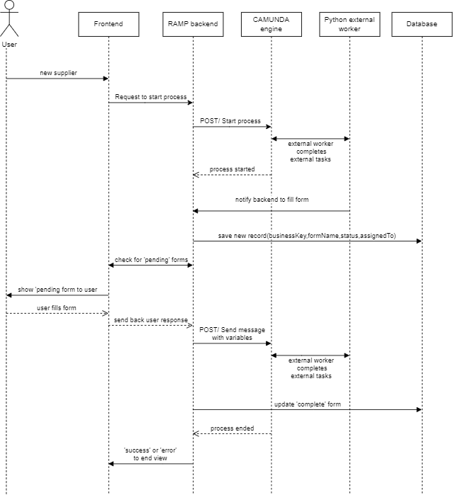

## Communication Flow Summary


### 1. Deploy BPMN Diagram via Camunda Modeler

- The BPMN diagram is created and deployed using the Camunda Modeler.

### 2. Run Python External Workers

- A Python script is executed to start external workers that handle specific tasks defined in the BPMN diagram.
- These workers listen for tasks from the Camunda engine and interact with the RAMP backend as necessary.

### 3. User Starts the Process via Frontend

- The user initiates a new process from the Angular frontend.
- The frontend sends a `POST` request to the Java backend to start this process including:
  ```json
  {
  "definitionKey":  "VOE",
  "businessKey":  "exampleUser@mail.com",
  "variables":  {}
  }
  ```

### 4. Java Backend Starts Process in Camunda Engine

- The Java backend receives the `POST` request and forwards it to the Camunda engine to create a new process instance.
- The **user’s email** is used as the **business key** in this request, allowing the process instance to be uniquely identified by the user.
- There are checks that don't allow to start multiple process with the same business key. 

### 5. External Worker Sends Task Request to RAMP Backend

- When a `sendTask` is reached in the process, the Python external worker sends a request to the RAMP backend, indicating that user input is required.
- This typically corresponds to exchange variables between Camunda engine and user input.

### 6. RAMP Backend Stores Task Information

- The RAMP backend stores a record including:
  - **Business Key**: The user's email, used as the unique identifier for the process.
  - **Form Name**: The name or ID of the `sendTask` activity that requires user input.
  - **Assigned To**: The email of the user who needs to fill the form.
  - **Status**: The status of the form, which can be either `pending` or `completed`.

### 7. Frontend Polls for Pending Forms

- The Angular frontend continuously polls the RAMP backend to check for any pending forms.
- If a pending form is found, the frontend displays the form to the user for completion.
- Once the user fills out the form, the frontend sends the data back to the RAMP backend, which updates the task status to `completed`.


### 8. RAMP Backend sends Message to Camunda Engine
- When a user fills the form and the frontend sends the data back to the RAMP backend, then the backend also
sends a message to Camunda engine to a **"Receive Task"** to pass the data to Camunda Engine.
---


### Sequence Diagram

The sequence diagram below illustrates the interaction between the components


---

