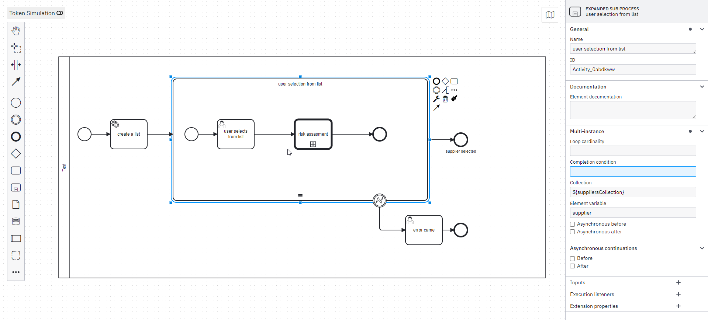
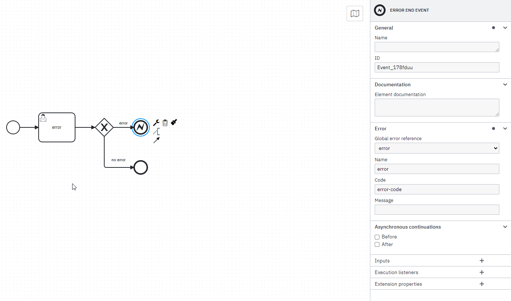
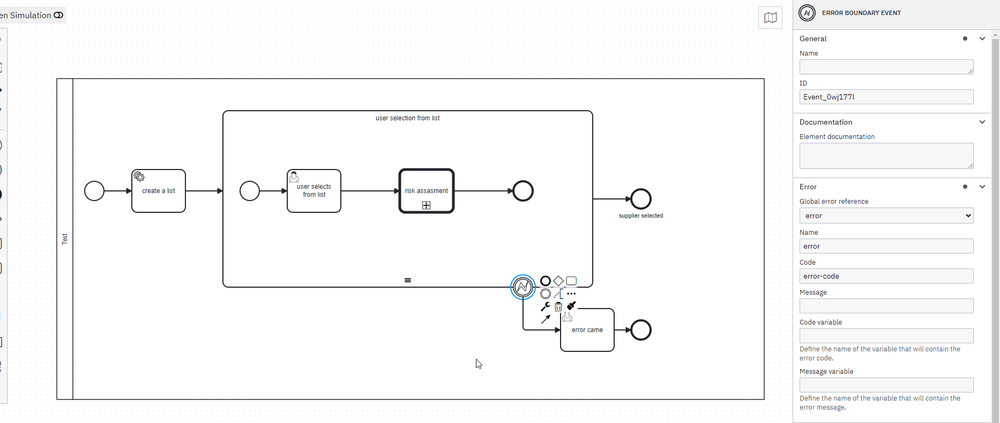
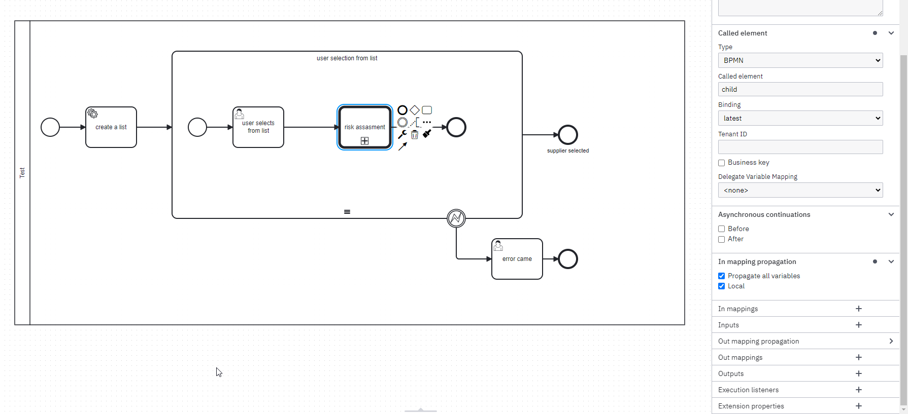

# Camunda BPMN Example - README

Example demonstrating a multi-instance sequential task, a boundary error event, and a call activity to another BPMN process.

## Table of Contents

- [Multi-Instance Sequential Task](#multi-instance-sequential-task)
- [Boundary Error Event](#error-event)
- [Call Activity](#call-activity)
- [How to Deploy and Test](#how-to-deploy-and-test)

## Multi-Instance Sequential Task

### Description
A multi-instance sequential task is a task that is executed multiple times, one instance after the other, based on a predefined collection of items.
A multi-instance activity ends when all instances are finished.

### Implementation Details

- **Collection Variable:** This is a list of items that the task will process one by one.
- **Element Variable:** This is the single item from the collection that the task is currently processing.

- **Loop Cardinality:** The number of instances are calculated once, when entering the activity. However you can specify the number of iteration based on this variable.

- **Completion Condition:** This is an optional expression that can be used to stop the multi-instance task before it completes all iterations. If the condition is met during the execution of any instance, the remaining instances will not be executed.

### Example Use Case

Multiple Instance documentation [here](https://docs.camunda.org/manual/7.21/reference/bpmn20/tasks/task-markers/).

## Error Event

### Description
An error event is used to handle exceptions that occur during the execution of a task. When an error is thrown within the task, the boundary error event catches it and allows for alternative processing or error handling.

### Implementation Details
- **Error Code:** In case an `errorRef` is provided and it references an existing error, the boundary event will only catch errors with the defined error code.

### Example Use Case
In our example, the child BPMN process has an **error end event** that generates the error with the **code:** *error code*.

On the other hand, the parent activity has an **error boundary event** that catches the `error code`. If there is no catch event within the child process to handle the error thrown, the error is propagated back to the parent activity.

Error events documentation [here](https://docs.camunda.org/manual/7.21/reference/bpmn20/events/error-events/).

## Call Activity

### Description
A call activity is used to encapsulate a reusable BPMN process that can be invoked from within another BPMN process. This allows for the modularization of complex processes and reusability of common workflows.

### Implementation Details
- **Called Element:** The **Called Element** refers to the BPMN process that is being invoked by the call activity. This is usually specified by the process ID or name. The called element must be a valid BPMN process that is deployed and accessible within the Camunda engine.

- **Input/Output Mapping:** Input and output mappings define how data is passed between the parent process and the called process. The input mapping transfers data from the parent process to the called element, while the output mapping transfers data back from the called process to the parent process. This ensures that the called process has the necessary information to execute and that any results or changes are propagated back to the parent process.

- **Synchronous/Asynchronous:** The call activity can be configured to execute either synchronously or asynchronously. If synchronous, the parent process waits for the called process to complete before continuing. If asynchronous, the parent process continues without waiting for the called process to finish.

- **Error Handling:** Errors that occur in the called process can be handled by the parent process if an error boundary event is attached to the call activity. If an error occurs and is not caught within the called process, it can be propagated back to the parent process, where it can be handled appropriately.

### Example Use Case

Call activity documentation [here](https://docs.camunda.org/manual/7.21/reference/bpmn20/subprocesses/call-activity/).

## How to Deploy and Test

Deploy via camunda modeler and run the examples_worker.py to handle the service task.

